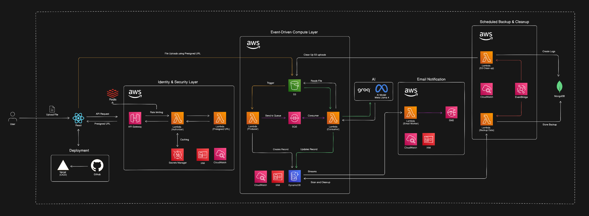

# AWS Serverless CV Summarizer

Serverless CV summarization engine automates resume data extraction using an event-driven AWS architecture. By decoupling file uploads from AI processing via Amazon SQS and Gemini AI, the system ensures high scalability and low latency while maintaining cost efficiency. The pipeline integrates robust security through AWS Secrets Manager and ensures data longevity with automated cross-cloud backups and storage cleanup.

 

Flow Diagram:

 

> Note: This project is a work in progress. Changes may be implemented in the upcoming updates.
