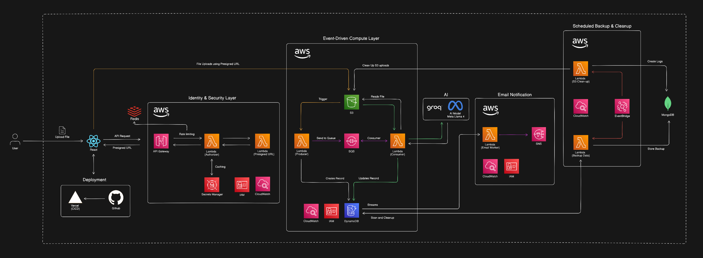
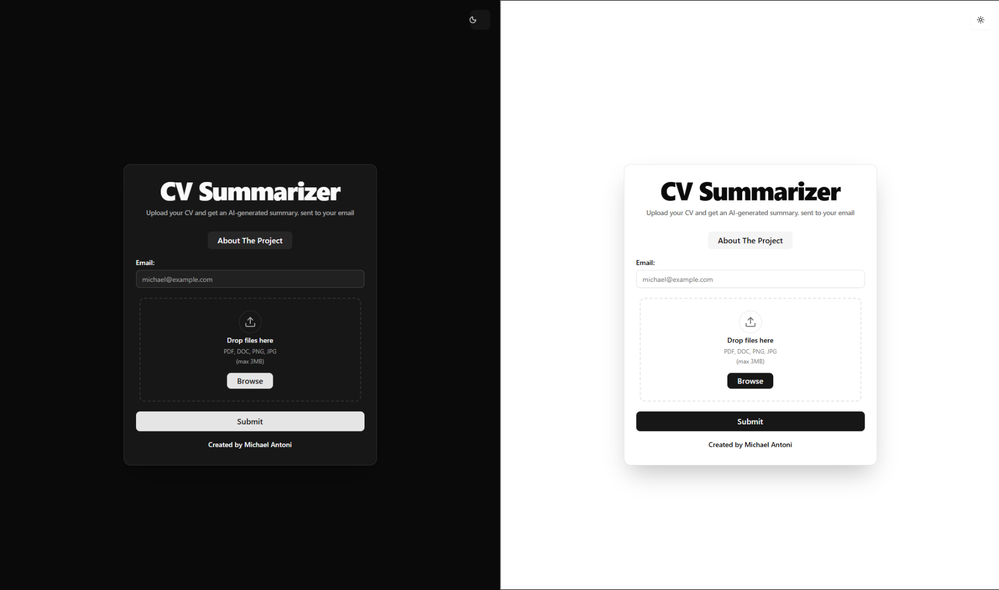

# AWS Serverless CV Summarizer

Serverless CV summarization engine utilizes an event-driven AWS architecture to ensure high scalability and loose coupling. Files uploaded to `Amazon S3` trigger an `AWS Lambda` function to extract CV data, which is then persisted in `Amazon DynamoDB`, while asynchronous AI processing is offloaded to `Amazon SQS` to ensure system resiliency during high traffic. A consumer Lambda processes queued tasks to execute summarization via [Groq AI](https://console.groq.com/docs/overview) and updates the database with the final results. Upon successful completion, the system sends a notification email using the [Resend API](https://resend.com/). Additionally, `Amazon EventBridge` manages scheduled jobs that archive processed records into a file stored in Amazon S3, after which the corresponding records in Amazon DynamoDB and related S3 files are purged to optimize storage and maintain lifecycle management.

**Visit Here:** https://m-antoni-serverless-cv-summarizer.vercel.app

#### Flow Diagram:



#### Frontend UI using React + Shadcn-ui:



---

### AWS Cloud Infrastructure

<table>
  <thead>
    <tr>
      <th style="width:15%; white-space: nowrap;">Service</th>
      <th>Description</th>
    </tr>
  </thead>
  <tbody>
    <tr>
      <td style="white-space: nowrap;">AWS Lambda</td>
      <td>Serverless compute service used to run backend functions for authentication, file processing, queue consumption, and job management.</td>
    </tr>
    <tr>
      <td style="white-space: nowrap;">AWS DynamoDB</td>
      <td>NoSQL database used to store CV processing jobs, metadata, and summarization results.</td>
    </tr>
    <tr>
      <td style="white-space: nowrap;">AWS API Gateway</td>
      <td>Handles public API endpoints, routing requests to Lambda functions and enforcing authorization.</td>
    </tr>
    <tr>
      <td style="white-space: nowrap;">AWS S3 Bucket</td>
      <td>Object storage used for uploading and temporarily storing CV files before processing.</td>
    </tr>
    <tr>
      <td style="white-space: nowrap;">AWS SQS</td>
      <td>Message queue used to decouple CV upload events from AI processing tasks.</td>
    </tr>
    <tr>
      <td style="white-space: nowrap;">AWS EventBridge</td>
      <td>Event scheduler used for background jobs such as archiving and cleanup tasks.</td>
    </tr>
    <tr>
      <td style="white-space: nowrap;">AWS Secrets Manager</td>
      <td>Secure storage for API keys and sensitive configuration such as AI and email credentials.</td>
    </tr>
    <tr>
      <td style="white-space: nowrap;">AWS IAM</td>
      <td>Manages roles and permissions for services to securely interact with AWS resources.</td>
    </tr>
    <tr>
      <td style="white-space: nowrap;">AWS CloudWatch</td>
      <td>Logging and monitoring service used to track Lambda execution, errors, and system metrics.</td>
    </tr>
  </tbody>
</table>

### Other Technologies

| Category           | Technologies                                            |
| ------------------ | ------------------------------------------------------- |
| Rate Limiting      | [Redis / Upstash](https://upstash.com/)                 |
| AI & Processing    | [AI Groq (LPU)](https://console.groq.com/docs/overview) |
| Frontend           | React.js (TypeScript)                                   |
| UI Components      | [Shadcn-ui](https://ui.shadcn.com/)                     |
| Email Notification | [Resend API](https://resend.com/)                       |
| CICD               | [Vercel.com](https://vercel.com/)                       |

---

### Key Features

- **Serverless Architecture** – Built entirely on AWS serverless services for high scalability and minimal infrastructure management.
- **Direct File Upload via Pre-signed URLs** – Secure CV uploads directly to Amazon S3 without exposing backend credentials.
- **Event-Driven Processing Pipeline** – Uses S3 triggers, AWS Lambda, and Amazon SQS to create a loosely coupled and resilient workflow.
- **AI-Powered CV Summarization** – Automatically generates structured summaries of uploaded CVs using Groq AI (LPU inference).
- **Asynchronous Processing** – Message queue (SQS) ensures reliable background processing even during high traffic.
- **Secure API Access** – Custom API Gateway Lambda authorizer validates incoming requests.
- **Email Notification System** – Automatically sends the summarized CV results to users via the Resend Email API.
- **Rate Limiting** – Protects API endpoints using Redis (Upstash) to prevent abuse and excessive requests.
- **Automated Data Lifecycle Management** – Scheduled jobs archive processed records and clean up expired data using EventBridge.
- **Real-Time Monitoring & Logging** – AWS CloudWatch tracks system performance, logs, and errors.
- **Modern Frontend UI** – Built with React, TypeScript, and Shadcn-UI for a responsive and clean user interface.
- **Serverless Deployment Pipeline** – Frontend deployed through Vercel for fast global delivery.

---

### Lambda Functions

- `cv-summarizer-auth-request-authorizer` - Handles API Gateway request authentication to ensure only authorized users can trigger the summarization process.
- `cv-summarizer-get-s3-presigned-url` - Generates secure, time-limited URLs allowing the frontend to upload CV files directly to the intake S3 bucket.
- `cv-summarizer-s3-intake-service` - Triggers upon file upload to validate the CV and prepare metadata before pushing the job to the processing queue.
- `cv-summarizer-s3-queue-consumer` - Processes messages from the SQS queue, pulling CVs from S3 to perform the actual AI summarization logic.
- `cv-summarizer-dispatch-email` - Sends the final AI-generated summary back to the user via the Resend Email API once processing is complete.
- `cv-summarizer-archive-job-records` - Moves finished job metadata from the active DynamoDB table to long-term storage or an archive table.
- `cv-summarizer-cleanup-job-records` - Periodically deletes temporary files from S3 and removes expired records from DynamoDB to manage storage costs.

**Lambda Layer: cv-summarizer-layer-collections**

Shared backend utils and dependencies.

**Required ZIP Structure:**

```
nodejs/
├─ utils/
├─ node_modules/
├─ package.json
└─ package-lock.json
```

1. **Structure:** Wrap everything in the `nodejs/` folder.
2. **Zip:** Make a zip the `nodejs` folder itself.
3. **Import:** `import { ... } from '/opt/nodejs/utils/filename.mjs';`
4. **AWS Setup:** Lambda Function -> Layers -> Add Layer -> Select Version.

By using `npm install --production`, you ensure that the layer remains lightweight by excluding devDependencies.

---

### AWS Secrets Manager

```
# Custom Key (Authorizer)
AUTH_SECRET_ID=
# AWS Cloud Services
AWS_REGION_ID=ap-southeast-1
S3_BUCKET_NAME=
API_PRESIGNED_URL=
PRESIGNED_URL_EXPIRES=300
DYNAMODB_TABLE_NAME=
SQS_QUEUE_URL=

# UpStash (Redis)
UPSTASH_REDIS_REST_URL=
UPSTASH_REDIS_REST_TOKEN=

# MongoDB URI Connection
MONGODB_URI=

# Groq AI
AI_API_KEYS=

# Resend Email API
RESEND_API_KEY=
```

### Frontend .ENV

```
VITE_API_URL=https://api.example.com.ap-southeast-1.amazonaws.com/dev
VITE_AUTH_KEY="your-secret-key"
```

---

### Project Purpose

This project was created to strengthen my practical experience with AWS serverless technologies and event-driven architecture by building a scalable CV summarization system. It demonstrates the integration of services such as Lambda, API Gateway, DynamoDB, S3, SQS, and EventBridge along with external APIs for AI processing and email notifications.

---

### Author

**Michael B. Antoni**  
LinkedIn: [https://linkedin.com/in/m-antoni](https://linkedin.com/in/m-antoni)  
Email: michaelantoni.tech@gmail.com
