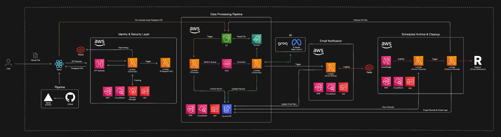
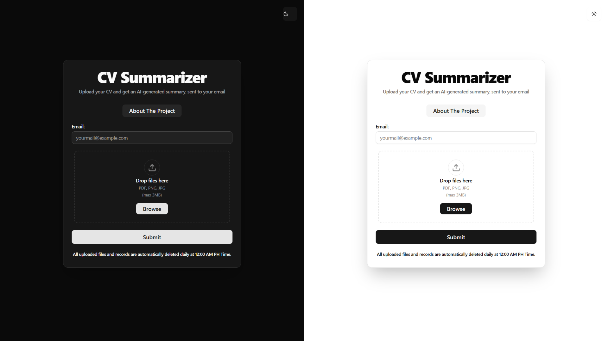

# AWS Serverless CV Summarizer

Serverless CV summarization engine utilizes an event-driven AWS architecture to ensure high scalability and loose coupling. Files uploaded to `Amazon S3` trigger a `AWS Lambda` function, which uses `Amazon Textract` to extract text and structured data from CVs. Extracted data is persisted in `Amazon DynamoDB`, while asynchronous AI processing is offloaded to `Amazon SQS` to ensure system resiliency during high traffic.

The entire backend infrastructure is defined as code using **AWS SAM (Serverless Application Model)** and deployed via `sam build && sam deploy`, replacing the previous manual per-function zip upload workflow.

A consumer Lambda processes queued tasks to execute summarization via [AI Groq LPU](https://console.groq.com/docs/overview) and updates the database with the final results. Upon successful completion, the system sends a notification email.

`Amazon EventBridge` manages scheduled jobs that archive processed records into a file stored in Amazon S3, after which the corresponding records in DynamoDB and related S3 files are purged to optimize storage and maintain lifecycle management.

**Visit Here:** https://m-antoni-serverless-cv-summarizer.vercel.app

#### Flow Diagram:



#### Frontend: Reactjs + Shadcn-ui



---

### Cloud Infrastructure

<table>
  <thead>
    <tr>
      <th style="width:15%; white-space: nowrap;">Service</th>
      <th>Description</th>
    </tr>
  </thead>
  <tbody>
    <tr>
      <td style="white-space: nowrap;">AWS Lambda</td>
      <td>Serverless service used to run backend functions for CV file processing, queue, and jobs.</td>
    </tr>
    <tr>
      <td style="white-space: nowrap;">AWS DynamoDB</td>
      <td>NoSQL database used to store CV processing jobs, metadata, and summarization results.</td>
    </tr>
    <tr>
      <td style="white-space: nowrap;">AWS API Gateway</td>
      <td>Handles public API endpoints, routing requests to Lambda functions and enforcing authorization.</td>
    </tr>
    <tr>
      <td style="white-space: nowrap;">AWS S3 Bucket</td>
      <td>Object storage used for uploading and temporarily storing CV files before processing.</td>
    </tr>
    <tr>
      <td style="white-space: nowrap;">AWS SQS</td>
      <td>Message queue used to decouple CV upload events from AI processing tasks.</td>
    </tr>
     <tr>
      <td style="white-space: nowrap;">AWS SNS</td>
      <td>Notification service used to capture and send alerts for Lambda errors.</td>
    </tr>
    <tr>
      <td style="white-space: nowrap;">AWS Textract</td>
      <td>Extract text from uploaded CV files (PDFs or images), allowing the system to process and summarize.</td>
    </tr>
    <tr>
      <td style="white-space: nowrap;">AWS EventBridge</td>
      <td>Event scheduler used for background jobs such as archiving and cleanup tasks.</td>
    </tr>
    <tr>
      <td style="white-space: nowrap;">AWS Secrets Manager</td>
      <td>Secure storage for API keys and sensitive configuration such as AI and email credentials.</td>
    </tr>
    <tr>
      <td style="white-space: nowrap;">AWS IAM</td>
      <td>Manages roles and permissions for services to securely interact with AWS resources.</td>
    </tr>
    <tr>
      <td style="white-space: nowrap;">AWS CloudWatch</td>
      <td>Logging and monitoring service used to track Lambda execution, errors, and system metrics.</td>
    </tr>
    <tr>
      <td style="white-space: nowrap;">AWS SAM</td>
      <td>Infrastructure-as-code framework that defines, builds, and deploys all serverless resources from a single `template.yaml`.</td>
    </tr>
  </tbody>
</table>

### Other Technologies

| Category                       | Technologies                                            |
| ------------------------------ | ------------------------------------------------------- |
| Rate Limiting & Logging        | [Redis (Upstash)](https://upstash.com/)                 |
| AI & Processing                | [AI Groq (LPU)](https://console.groq.com/docs/overview) |
| Frontend                       | React.js + TypeScript                                   |
| UI Components                  | [Shadcn-ui](https://ui.shadcn.com/)                     |
| Client Email Notification      | [Nodemailer](https://nodemailer.com/)                   |
| Backend Job Email Notification | [Resend](https://resend.com/)                           |
| CI/CD                          | [Vercel](https://vercel.com/)                           |
| Infrastructure as Code         | [AWS SAM](https://aws.amazon.com/serverless/sam/)       |

---

### Key Features

#### Architecture & Infrastructure

- **Serverless Architecture** – Fully built on AWS serverless services for high scalability and minimal infrastructure management.
- **Event-Driven Processing** – Uses S3 triggers, AWS Lambda, and Amazon SQS for a loosely coupled and resilient workflow.
- **Asynchronous Processing** – SQS ensures reliable background processing even under high traffic.
- **Automated Data Lifecycle Management** – Scheduled EventBridge jobs archive processed records and clean up old data.
- **Serverless Deployment Pipeline** – Frontend deployed via Vercel for fast global delivery.
- **Infrastructure as Code** – Entire backend defined in `template.yaml` and deployed via AWS SAM CLI.

#### File Handling & Security

- **Direct File Upload via Pre-signed URLs** – Securely upload CVs to S3 without exposing backend credentials.
- **Secure API Access** – Custom API Gateway Lambda authorizer validates incoming requests.
- **Rate Limiting** – Redis (Upstash) protects API endpoints from abuse and excessive requests.

#### AI & Processing

- **AI-Powered CV Summarization** – Automatically generates structured summaries of uploaded CVs using Groq AI (LPU inference).

#### User Experience

- **Email Notification System** – Automatically sends summarized CV results via Nodemailer.
- **Modern Frontend UI** – Built with React, TypeScript, and Shadcn-UI for a responsive and clean interface.

#### Monitoring & Observability

- **Real-Time Monitoring & Logging** – AWS CloudWatch tracks system performance, logs, and errors.

---

### Processing Flow

1. User enters their email and uploads a CV file.
2. The file is uploaded directly to **Amazon S3** using a **pre-signed URL**.
3. The **S3 upload event** triggers an **AWS Lambda** function.
4. The Lambda function sends a message to an **Amazon SQS FIFO queue**.
5. A **consumer Lambda** processes the queued job:
   - **AWS Textract** extracts text from the CV document
   - Sends the extracted text to the **Groq AI** to summarize.
6. The generated AI summary is stored in **Amazon S3** as a JSON file.
7. A confirmation email containing the results is sent to the user.
8. The job record is updated in **Amazon DynamoDB** with the status `COMPLETED`.
9. A scheduled **Amazon EventBridge rule** runs daily at **12:00 AM** to clean up old records and delete associated files from **S3**.

---

### Lambda Functions

- `cv-summarizer-auth-request-authorizer` - Handles API Gateway request authentication to ensure only authorized users can trigger the summarization process.
- `cv-summarizer-get-s3-presigned-url` - Generates secure, time-limited URLs allowing the frontend to upload CV files directly to the intake S3 bucket.
- `cv-summarizer-s3-intake-service` - Triggers upon file upload to validate the CV and prepare metadata before pushing the job to the processing queue.
- `cv-summarizer-s3-queue-consumer` - Processes messages from the SQS queue, pulling CVs from S3 to perform the actual AI summarization logic.
- `cv-summarizer-dispatch-email` - Sends the final AI-generated summary back to the user via the Nodemailer once processing is complete.
- `cv-summarizer-archive-job-records` - Moves finished job metadata from the active DynamoDB table to long-term storage or an archive table.
- `cv-summarizer-cleanup-job-records` - Scheduled to run every midnight, this process deletes files from S3 and removes records from DynamoDB to manage storage costs, and sends a summary email via the Resend Email API.

### Deployment

The entire backend is deployed as infrastructure-as-code via **AWS SAM CLI**.

**Prerequisites:**

- AWS CLI configured with credentials (`aws configure`)
- SAM CLI installed (`brew install aws-sam-cli` or [download](https://docs.aws.amazon.com/serverless-application-model/latest/developerguide/install-sam-cli.html))
- Node.js 20.x

**Step 1 — Build:**

```bash
cd backend
sam build
```

This packages each Lambda function's source code and installs the shared layer's dependencies (from `layers/shared-dependency/nodejs/package.json`).

**Step 2 — Deploy:**

```bash
sam deploy
```

This uploads the artifacts to S3, then CloudFormation creates or updates all resources:

- 7 Lambda functions with the shared layer attached
- API Gateway endpoints (`/authorizer`)
- SQS event source mapping for the queue consumer
- EventBridge schedule for midnight archive
- Lambda permissions for S3 invoke

**Configuration:**

All parameters are stored in `samconfig.toml`:

| Parameter             | Description                                    |
| --------------------- | ---------------------------------------------- |
| `stack_name`          | `aws-serverless-cv-summarizer`                 |
| `region`              | `ap-southeast-1`                               |
| `parameter_overrides` | 7 IAM role ARNs, SQS queue ARN, S3 bucket name |

Parameters are passed automatically from `samconfig.toml` — no need to specify them each time.

**One-time manual step after first deploy:**

After deployment, update the S3 bucket event notification in the AWS Console to trigger the new `cv-summarizer-s3-intake-service` function on file uploads.

### Lambda Layer

**Layer Name:** `cv-summarizer-dependencies`

Shared backend utils and dependencies, built automatically by SAM from `layers/shared-dependency/nodejs/`.

```
nodejs/
├─ utils/
│   ├─ authorization.mjs
│   ├─ secrets.mjs
│   ├─ redis.mjs
│   └─ sns.mjs
├─ node_modules/
├─ package.json
└─ package-lock.json
```

The layer is attached to all functions globally via `template.yaml`:

---

### DyanmoDB (sample data)

Table name: `cv_summarizer_metadata`

```
{
  "job_id": "a88552fd-3e67-443b-b0cc-1e76c8ad9f76",
  "created_at": "2026-03-14T14:39:09.281Z",
  "email": "sample@gmail.com",
  "email_sent": true,
  "email_sent_at": "2026-03-14T14:39:19.403Z",
  "ip_address": "136.158.40.158",
  "process_at": "2026-03-14T14:39:06.723Z",
  "s3_bucket_arn": "arn:aws:s3:::cv-summarizer-dev",
  "s3_bucket_name": "cv-summarizer-dev",
  "sqs_message": {
    "arn": "arn:aws:sqs:ap-southeast-1:<AWS_ACCOUNT_ID>:cv-summarizer-dev-process-queue.fifo",
    "message_group_id": "uploads",
    "message_id": "652a7b3f-6bde-4ab0-9678-b725c0e8a800",
    "received_at": "2026-03-14T14:39:11.232Z",
    "received_count": "1",
    "sender_id": "AROAYAEVQ6IUMF76TH7WD:cv-summarizer-s3-intake-service",
    "sent_timestamp": "1773499150079"
  },
  "stage_1_upload": {
    "file_metadata": {
      "file": "michael.pdf",
      "format": "pdf",
      "size_bytes": 124231
    },
    "key": "uploads/<USER_ID>/michael.pdf",
    "url": "https://<YOUR-AWS-API-URL>/uploads/<USER_ID>/michael.pdf"
  },
  "stage_2_document_parsing": {
    "key": "uploads/<USER_ID>/2026-03-14T14-39-16-870Z_extracted-text.txt",
    "length": 4037,
    "url": "https://<YOUR-AWS-API-URL>/uploads/<USER_ID>/2026-03-14T14-39-16-870Z_extracted-text.txt"
  },
  "stage_3_ai_summary": {
    "key": "uploads/<USER_ID>/2026-03-14T14-39-18-269Z_ai_summary.json",
    "length": "2387",
    "url": "https://<YOUR-AWS-API-URL>/uploads/<USER_ID>/2026-03-14T14-39-18-269Z_ai_summary.json"
  },
  "status": "COMPLETED",
  "updated_at": "2026-03-14T14:39:18.338Z",
  "user_id": "<USER_ID>"
}
```

Table name: `cv_summarizer_archived_logs`

```
{
  "log_id": "ac5c6d33-9f5c-4b63-8ce2-20b8ddfa052a",
  "created_at": "2026-03-15T17:12:10.795Z",
  "dynamodb_cleanup": {
    "success": true,
    "table_name": "cv_summarizer_metadata",
    "total_deleted_items": 21,
    "total_failed": 0
  },
  "s3_cleanup": {
    "bucket_name": "cv-summarizer-dev",
    "s3_folder": "uploads/",
    "source_key": "cleanup-jobs/cleanup_job_2026-03-15_.json",
    "source_url": "https://<YOUR-AWS-API>/cleanup-jobs/cleanup_job_2026-03-15_.json",
    "success": true,
    "total_deleted_files": 18,
    "total_failed": 0
  }
}
```

---

### AWS Secrets Manager

```
# Custom Key (Authorizer)
AUTH_SECRET_ID=
# AWS Cloud Services
AWS_REGION_ID=ap-southeast-1
S3_BUCKET_NAME=
API_PRESIGNED_URL=
PRESIGNED_URL_EXPIRES=300
DYNAMODB_TABLE_NAME=
DYNAMODB_LOG_TABLE=
SQS_QUEUE_URL=
SNS_ERROR_TOPIC_ARN=

# UpStash (Redis)
UPSTASH_REDIS_REST_URL=
UPSTASH_REDIS_REST_TOKEN=

# Groq AI
AI_API_KEYS=

# Resend Email API
RESEND_API_KEY=

# Nodemailer
SMTP_HOST=
SMTP_PORT=
SMTP_SECURE=
SMTP_USER=
SMTP_PASS=
```

### Frontend .ENV

```
VITE_API_URL=https://api.example.com.ap-southeast-1.amazonaws.com/dev
VITE_AUTH_KEY="your-secret-key"
```

---

### Project Purpose

This project was created to strengthen my practical experience with AWS serverless technologies and event-driven architecture by building a scalable CV summarization system. It demonstrates the integration of services such as Lambda, API Gateway, DynamoDB, S3, SQS, and EventBridge along with external APIs for AI processing and email notifications. The backend is fully managed via **AWS SAM** for automated infrastructure-as-code deployments.

---

### Author

**Michael B. Antoni**  
LinkedIn: [https://linkedin.com/in/m-antoni](https://linkedin.com/in/m-antoni)  
Email: michaelantoni.tech@gmail.com
